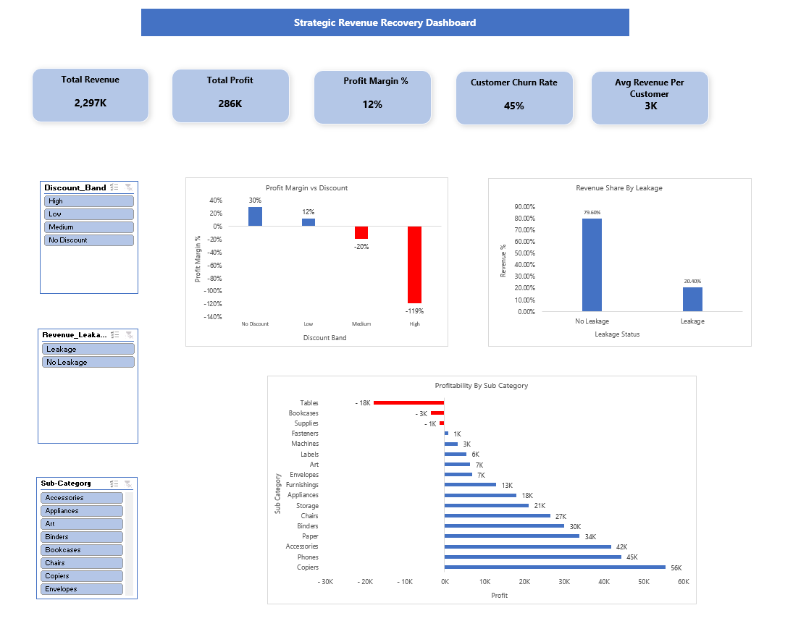
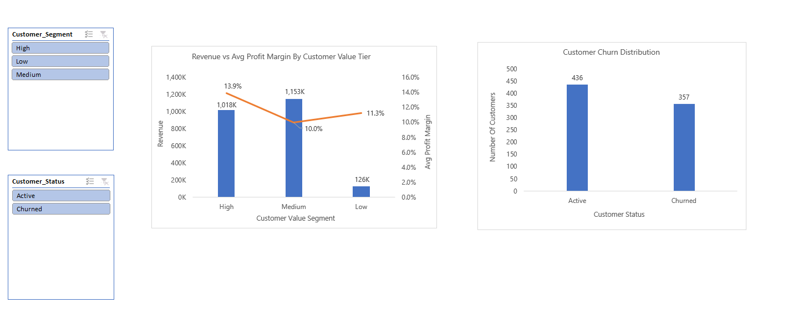
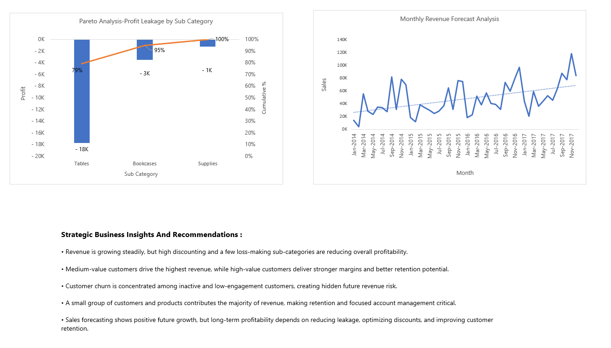

# Strategic Revenue Recovery : Root Cause And Predictive Analysis Of Customer Churn And Revenue Leakage.  
## Project Overview

This project focuses on identifying revenue leakage, understanding customer churn, and improving overall profitability using Excel-based business analysis.

The goal was to move beyond basic reporting and understand where profit is being lost, which customers create the most value, and what actions can help improve long-term business performance.

The project was built using feature engineering, customer segmentation, churn analysis, profitability analysis, Pareto analysis, monthly forecasting, and an interactive dashboard.

## Business Objective

To identify revenue leakage, reduce customer churn, and improve profitability by analyzing discount impact, customer value, product performance, and long-term revenue trends.

## Key KPIs Tracked
Total Revenue
Total Profit
Profit Margin %
Average Revenue Per Customer
Customer Churn Rate

## Analysis Areas Covered
Revenue Leakage Analysis
Discount Impact on Profitability
Customer Value Segmentation
Customer Churn Analysis
Sub-Category Profitability Analysis
Pareto Analysis (80/20 Rule)
Monthly Revenue Forecast Analysis

## Tools & Analytical Techniques Used
Microsoft Excel
Pivot Tables
Pivot Charts
Slicers
Conditional Formatting
Feature Engineering
Customer Segmentation
Churn Classification
Pareto Analysis
Forecasting
Customer Summary Analysis

## Dashboard Preview
### Executive Overview

### Customer Analysis

### Strategic Insights

## Key Business Insights
High discounting and a few loss-making sub-categories are reducing overall profitability.
Medium-value customers generate the highest revenue, while high-value customers deliver stronger margins and better long-term value.
Customer churn is mainly concentrated among inactive and low-engagement customers.
A small group of customers and products contributes the majority of total revenue.
Future revenue growth looks positive, but sustainable profitability depends on reducing leakage and improving retention.

## Recommendations
Reduce aggressive discounting on low-margin products
Focus retention efforts on high-value and at-risk customers
Improve low-performing sub-categories such as loss-making products
Strengthen upselling strategies for medium-value customers
Prioritize top-performing customers and products that drive most revenue
 
## Expected Business Outcome
Improve overall profitability by controlling discount leakage, reducing churn, and focusing on high-value customers and profitable product categories. This helps protect revenue, improve margins, and support long-term business growth.

Files Included
Raw dataset
Feature engineering table
Customer summary table
Analysis sheet
Final interactive dashboard
Dashboard screenshots

This project was created as part of my data analytics portfolio to demonstrate business problem-solving, dashboard storytelling, and decision-focused analysis using Excel.
